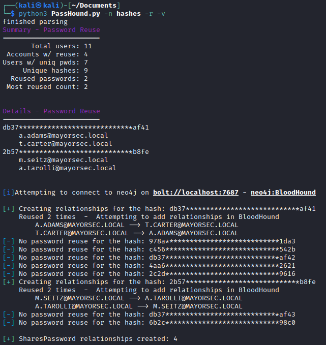

# PassHound - Easily Add Password Reuse to BloodHound

This tool parses a ntds file to find users that share a password and creates a new relationship in BloodHound. Because password reuse on the domain is a big problem, it increases the chances of attackers pivoting the network through other users and possibly gaining additional access.

For example, an IT admin may have a regular user account and an domain administrator account that has more privileges. If the same password is used for both accounts, an attacker can easily gain access to the admin account and compromise the domain. PassHound can help to identify this problem by adding the `SharedPasswordWith` relationship to the Neo4j database and have it easily viewable within BloodHound. With this new relationship in BloodHound, it can uncover attack paths that could have previously been overlooked and help report these findings.


## Usage

```bash
usage: PassHound.py [-h] -n NTDS [-url URL] [-u USERNAME] [-p PASSWORD] [-bh] [-hash] [-v] [-r]

Update bloodhound database to show password reuse

options:
  -h, --help        	show this help message and exit
  -n NTDS, --ntds NTDS  NTDS file that contains all domain users and hashes. Supports the standard format - DOMAIN.COM\USER:NTHASH
  -url URL, --url URL   The neo4j url to auth to (defaults to bolt://localhost:7687)
  -u USERNAME, --username USERNAME
                    	Username to login to neo4j (defaults to neo4j)
  -p PASSWORD, --password PASSWORD
                    	Password to login to neo4j (defaults to bloodhound)
  -hash, --hash     	Add the "Hash" field to users in BloodHound
  -v, --verbose     	verbose
  -r, --redact      	Redact hashes from stdout
```

Example
```bash
python3 PassHound.py -n hashes -v -p RealPass123
```



## BloodHound Usage

There are several custom queries added for convenience to utilize the new `SharesPassword` relationship. Unfortunately, several predefined queries do not include non-default relationships, but they can still be utilized by making simple changes.

 To make the changes to these default queries easy, check the `Query Debug Mode` box within BloodHound's settings. This will allow you to easily modify these queries to include the new missing relationship if needed.

**Example**: Shortest Path to Domain Admin (fix already included in `customqueries.json`)

The problem in some predefined queries stems from them listing specific relationships between users and not just including all of them. This is the query for "Shortest Path to Domain Admin"
```js
MATCH p=shortestPath((n)-[:MemberOf|HasSession|AdminTo|AllExtendedRights|AddMember|ForceChangePassword|GenericAll|GenericWrite|Owns|WriteDacl|WriteOwner|CanRDP|ExecuteDCOM|AllowedToDelegate|ReadLAPSPassword|Contains|GPLink|AddAllowedToAct|AllowedToAct|WriteAccountRestrictions|SQLAdmin|ReadGMSAPassword|HasSIDHistory|CanPSRemote|SyncLAPSPassword|AZAddMembers|AZAddSecret|AZAvereContributor|AZContains|AZContributor|AZExecuteCommand|AZGetCertificates|AZGetKeys|AZGetSecrets|AZGlobalAdmin|AZGrant|AZGrantSelf|AZHasRole|AZMemberOf|AZOwner|AZOwns|AZPrivilegedRoleAdmin|AZResetPassword|AZUserAccessAdministrator|AZAppAdmin|AZCloudAppAdmin|AZRunsAs|AZKeyVaultContributor|AZVMAdminLogin|AddSelf|WriteSPN|AddKeyCredentialLink*1..]->(m:Group {name:"DOMAIN ADMINS@EXAMPLE.LOCAL"})) WHERE NOT n=m RETURN p
```

The predefined query doesn't include the newly created `SharesPassword` relationship which could show some additional paths. There are two easy fixes for these types of queries.
1. Update the long list of relationships to `[*1..]` to include **ALL** relationships
2. Add the new relationship to the long list of existing relationships by adding `|SharesPassword`


## Future Updates/Ideas???
- Parse secretsdump
  - Local admin password reuse
  - Support different hash types
- Parse output from responder
- Reporting generation
- Additional custom queries
  - save hashes to neo4j? (might be useful with new custom queries)
- sqlite db for hashes (WIP)
  - Support multiple hash types


### Credits
[CrackHound](https://github.com/trustedsec/CrackHound) was leaned on heavily for working with Neo4j
